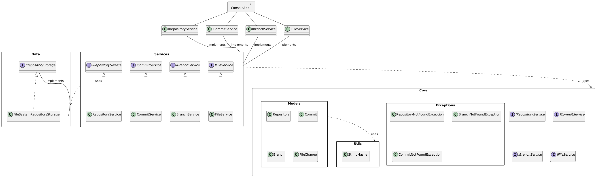
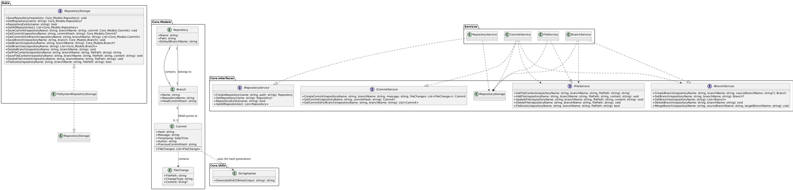
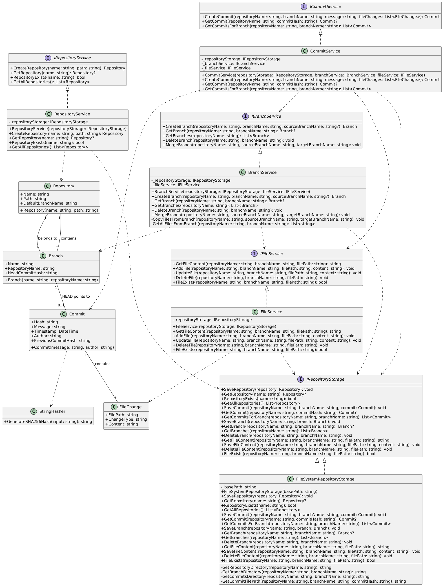
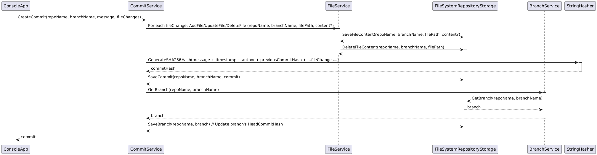

# MyVersionControlSystem

A simplified version control system built with .NET Core and C#. This project demonstrates the core concepts of version control, including repository creation, committing changes, branching, and merging. It's designed as an educational project and is not intended for production use.

## Table of Contents

1.  [Introduction](#introduction)
2.  [Features](#features)
3.  [Architecture](#architecture)
4.  [Folder Structure](#folder-structure)
5.  [Technologies Used](#technologies-used)
6.  [Getting Started](#getting-started)
    *   [Prerequisites](#prerequisites)
    *   [Installation](#installation)
    *   [Usage](#usage)
7.  [Diagrams](#diagrams)
    *   [High-Level Diagram](#high-level-diagram)
    *   [Low-Level Diagram](#low-level-diagram)
    *   [UML Class Diagram](#uml-class-diagram)
    *   [Sequence Diagram](#sequence-diagram)
8.  [Performance Considerations](#performance-considerations)
9.  [Future Enhancements](#future-enhancements)
10. [Contributing](#contributing)
11. [License](#license)

## Introduction

This project aims to provide a basic understanding of how version control systems work. It implements a simplified model of Git-like functionality, allowing users to create repositories, commit changes, create branches, and merge branches. The system uses a file-based storage mechanism for simplicity.

## Features

*   **Repository Creation:** Create new repositories with a specified name and path.
*   **Committing Changes:**  Take snapshots of the repository at a specific point in time, including file changes (add, modify, delete).
*   **Branching:** Create parallel lines of development within a repository.
*   **Merging:**  Combine changes from one branch into another.
*   **File Management:** Add, update, and delete files within a repository.
*   **Basic Version History:** View the commit history for a branch.

## Architecture

The system follows a layered architecture to separate concerns and improve maintainability:

*   **Core:**  Contains the core business logic and interfaces.
*   **Services:**  Implements the interfaces defined in the Core layer.
*   **Data:**  Handles data persistence (in this case, using the file system).
*   **ConsoleApp:**  A simple command-line interface for interacting with the system.

## Folder Structure

## Technologies Used

*   .NET Core
*   C#
*   System.Text.Json (for serialization)

## Getting Started

### Prerequisites

*   .NET Core SDK (version 6.0 or later)

### Installation

1.  Clone the repository:

    ```bash
    git clone <repository_url>
    ```

2.  Navigate to the project directory:

    ```bash
    cd MyVersionControlSystem
    ```

3.  Restore the NuGet packages:

    ```bash
    dotnet restore
    ```

### Usage

1.  Build the console application:

    ```bash
    dotnet build MyVersionControlSystem.ConsoleApp
    ```

2.  Run the console application:

    ```bash
    dotnet run --project MyVersionControlSystem.ConsoleApp
    ```

Follow the prompts in the console application to create repositories, commit changes, and perform other version control operations.

## Diagrams

### High-Level Diagram



### Low-Level Diagram



### UML Class Diagram



### Sequence Diagram



**(Replace the placeholders below with actual diagram images or links to diagrams.)**

### High-Level Diagram

This diagram shows the main components of the system and their relationships.